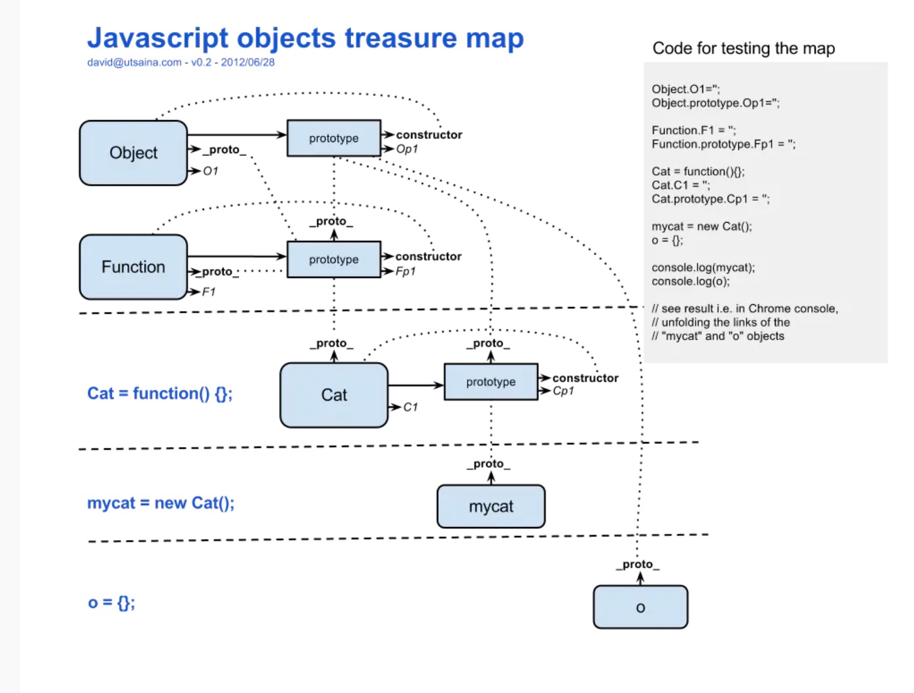

* 使用工厂方法创建对象
  **用的不多，使用的构造函数都是object，创建的对象都是object类型，无法区分多种不同类型的对象**
  ```js
        function creatPerson(name,age,gender){
            var obj=new Object;
            obj.name=name;
            obj.age=age;
            obj.gender=gender;
            obj.sayname=function(){
                console.log(this.name);
            };
            return obj;
        }

        var tom=creatPerson('tom',12,'male');
        var mary=creatPerson('mary',8,'female');
    ```
* 构造函数（类）
  * **使用new关键字调用**
  ```js
        var per=new person();
    ```
  * 执行流程
    1、立即创建一个对象
    2、将新建的对象设为函数中的this
    3、逐行执行函数中的代码
    4、将新建的对象作为返回值返回

  * 检查一个对象是否是一个类（构造函数）的实例
    ```js
        console.log(per instanceof person);
    ```
    ```js
        console.log(person.prototype.isPrototypeOf(per));
    ```
  * 使对象共有的属性和方法，在构造函数的原型对象中定义
    ```js
        function person(name){
            this.name=name;
        }
        person.prototype.sayname= function(){
            console.log(this.name);
        }
    ```
  * 检查对象自身是否有某属性
    ```js
        console.log(per.hasOwnProperty('name'));//true
        console.log(per.__proto__.__proto__.hasOwnProperty('hasOwnProperty'));//true
    ```
* this
  * 以函数的形式调用-->window
  
  * 以方法的形式调用-->谁调用就是谁 
  * 以构造函数的形式调用-->新建的对象

* 原型链
  ```js
  let o = new f();
  // o.[[Prototype]].[[Prototype]] 是 Object.prototype.
  ```
  * 每个构造函数(constructor)都有一个原型对象(prototype),原型对象都包含一个指向构造函数的指针,而实例(instance)都包含一个指向原型对象的内部指针.

  * 如果试图引用对象(实例instance)的某个属性,会首先在对象内部寻找该属性,直至找不到,然后才在该对象的原型(instance.prototype)里去找这个属性.
  * Object.__proto__指向Function.prototype
  * 所有的函数构造函数都是Function,所以Cat.__proto__指向Function.prototype，Function不继承自任何其他的构造函数，所以Function.prototype__proto__指向Object.prototype
  * 所有的原型的constructor都指向构造函数

    
* new
  **new干了什么？**
  ```js
    var obj  = {};
    obj.__proto__ = F.prototype;
    F.call(obj);
    ```
  * 创建一个空对象

  * 将这个对象的__proto__成员指向F函数对象prototype成员对象
  * 将F函数对象的this指针替换成obj，然后再调用F函数
  
* toString()
  在页面中打印对象时，输出对象的toString()方法的返回值,可以修改此方法
  ```js
  per.toString=function(){
            return this.name;
        }
    ```